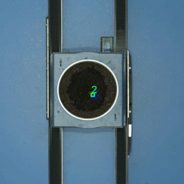
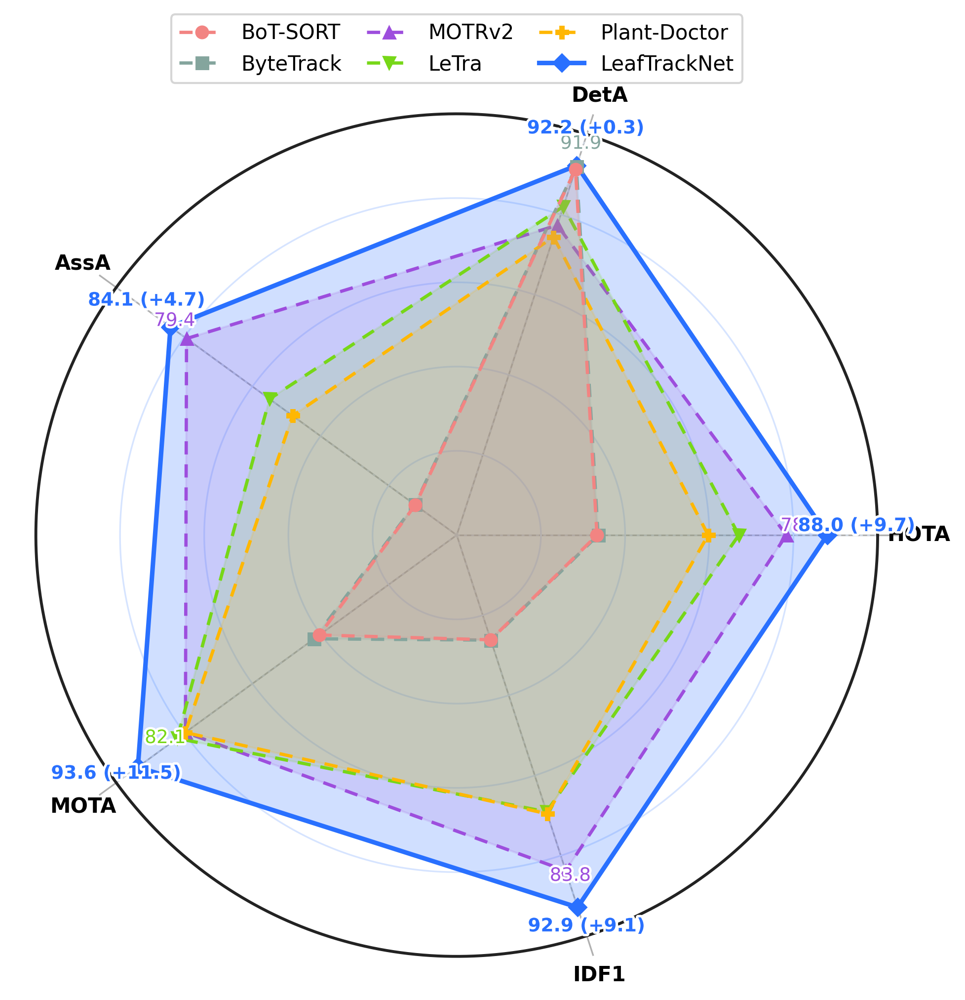

# LeafTrackNet

This repository provides an official implementation of **LeafTrackNet** for leaf-level multi-object tracking (MOT) from top-down plant imagery.


<table>
  <tr>
    <td align="center" width="45%">
      
    </td>
    <td align="center" width="45%">
      
    </td>
  </tr>
  <tr>
    <td align="center"><em>Demo: stable per-leaf tracking under plant-specific challenges.</em></td>
    <td align="center"><em>Benchmark: SOTA across HOTA/DetA/AssA/IDF1/MOTA.</em></td>
  </tr>
</table>

## Installation
```bash
conda create -n leaftracknet python=3.10 -y
conda activate leaftracknet
pip install -r requirements.txt
```

## Dataset

**CanolaTrack**

- **Dataset:** [CanolaTrack <sup>©</sup> BASF SE](https://huggingface.co/datasets/shl-shawn/CanolaTrack/tree/main/CanolaTrack)  
- **Precomputed proposals (YOLOv10):** [Proposals JSONs](https://huggingface.co/datasets/shl-shawn/CanolaTrack/tree/main/proposals)  
- *(Optional)* **YOLOv10 detector weights:** [Detector weights](https://huggingface.co/datasets/shl-shawn/CanolaTrack/tree/main/weights)


<details>

<summary>Use your own dataset</summary>

Convert your data to the same MOT-style structure, and the expected layout is:

``` bash
data/
├── train/
│   └── <sequence_name>/
│       ├── gt/
│       │   └── gt.txt            # CSV: frame,id,x,y,w,h,*,*,*
│       └── img/
│           └── {frame:08d}.jpg
├── val/
│   └── <sequence_name>/
│       ├── gt/
│       │   └── gt.txt
│       └── img/
│           └── {frame:08d}.jpg
└── proposals/
    ├── det_db_train.json
    └── det_db_val.json
```

**Proposals JSON format.**  
`infer.py` expects a JSON that maps a per-frame key to a list of detection lines:
```json
{
  "val/Plant-001/00000001.txt": ["x,y,w,h,conf", "x,y,w,h,conf"],
  "val/Plant-001/00000002.txt": ["x,y,w,h,conf"]
}
```
</details>


## Training 
You may use the following command for training LeafTrackNet on single or multiple GPUs:

```bash
# single GPU
python train.py --config configs/default.yaml \
  --train_root data/train --output_dir outputs/leaf_reid --backbone mobilenet_v3

# multiple GPUs
torchrun --nproc_per_node {NUM_GPUS} train.py \
  --config configs/default.yaml --output_dir outputs/leaf_reid --backbone mobilenet_v3
```


## Inference / tracking on CanolaTrack Test Set
The trained LeafTrackNet model weights can be downloaded from the [link](https://huggingface.co/datasets/shl-shawn/CanolaTrack/tree/main/weights).
```bash
python infer.py --checkpoint_path {TRAINED_WEIGHT} \
  --config configs/default.yaml \
  --proposals_json data/proposals/det_db_val.json \
  --image_root data/val \
  --output_dir outputs/leaf_reid \
  --threshold 0.4 --update_mode mean
```
Output MOT files appear in `outputs/leaf_reid/tracks/{plant}.txt` with lines:
```
frame, id, bb_left, bb_top, bb_width, bb_height, sim, -1, -1, -1
```

Benchmark Results:
```bash
./scripts/eval.sh
```


## Citing
Please cite as followed if you use **CanolaTrack** dataset or **LeafTrackNet** framework.
```bibtex
@article{leaftracknet2025,
  title={LeafTrackNet: A Deep Learning Framework for Robust Leaf Tracking in Top-Down Plant Phenotyping},
  year={2025},
}
